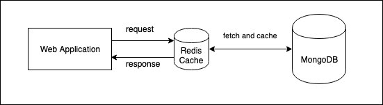

## Tiny Url
<a href='https://en.wikipedia.org/wiki/TinyURL'>Tiny url</a> is a service that help you shorten a long url so it become nicer and shorter for sharing.

It's a web application with a frontend designed as a single page application based on react.js and a REST API backend written in Golang.

### Requirements
 * Docker compose
 
### Documentation
 * About stack
    * The web frontend application base on react.js 
    * The web backend application base on gin
    * Javascript
    * Golang
    * Redis server
    * MongoDB server
    
 * Architecture
 
     
    
 * The web frontend application is on github and docker hub:
    * https://github.com/pqnguyen/tinyurl_web (source code)
    * https://hub.docker.com/r/pqnguyen/tinyurl_web (docker image)

### How to get started (for developers)
1. Clone repository to your local computer.
2. Go to project directory
3. Run ```docker-compose up --build```

- all dependency technologies was setup in docker compose, so you just pull the source code and run docker compose

### License
 